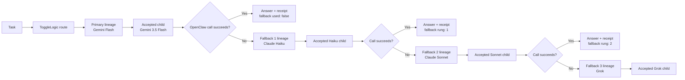

# Model-family fallback architecture

Status: public integration contract
Version: ToggleLogic Free 1.5.1

An ordered fallback chain and a model family solve different problems:

- The **family** keeps a policy current as new model children are released.
- The **ordered chain** keeps a task running when the selected child is unavailable.

ToggleLogic resolves and verifies the policy. OpenClaw executes the concrete
chain. This separation may be protected by our patent pending.



## Two representations are intentional

The durable deployment policy stores family aliases and their order. Each alias
may include an `acceptedModels` allowlist so discovery alone cannot put an
unapproved child into production.

OpenClaw requires concrete `provider/model` references at execution time. A
deployment materializes the currently accepted children into
`agents.defaults.model.primary` and `agents.defaults.model.fallbacks` before
startup. A numbered child in that host field is therefore an execution artifact,
not the durable policy.

## Ownership boundary

1. The deployment owns acceptance records and writes host configuration.
2. ToggleLogic resolves the declared families, checks the order, and reports
   drift. It never edits OpenClaw configuration by itself.
3. OpenClaw invokes the primary and advances through concrete fallbacks.
4. ToggleLogic does not reclassify the same logical turn during fallback; it
   passes through the host's next candidate.
5. Runtime receipts use host evidence to distinguish a policy reroute from a
   real fallback.

## Example

```json
{
  "familyResolution": {
    "enabled": true,
    "aliases": {
      "gemini-flash": {
        "family": "gemini-flash",
        "providers": ["google"],
        "strategy": "newest",
        "acceptedModels": ["google/gemini-3.5-flash"]
      },
      "claude-haiku": {
        "family": "claude-haiku",
        "providers": ["anthropic"],
        "strategy": "newest",
        "acceptedModels": ["anthropic/claude-haiku-4-5"]
      },
      "claude-sonnet": {
        "family": "claude-sonnet",
        "providers": ["anthropic"],
        "strategy": "newest",
        "acceptedModels": ["anthropic/claude-sonnet-4-6"]
      },
      "grok": {
        "family": "grok",
        "providers": ["xai"],
        "strategy": "newest",
        "acceptedModels": ["xai/grok-4.3"]
      }
    },
    "hostPlan": {
      "primary": "gemini-flash",
      "fallbacks": ["claude-haiku", "claude-sonnet", "grok"]
    }
  }
}
```

If a newer child appears in a catalog but is absent from `acceptedModels`, the
current accepted child remains selected. If any rung is unavailable, the whole
plan is reported unresolved rather than silently reordered or shortened.
