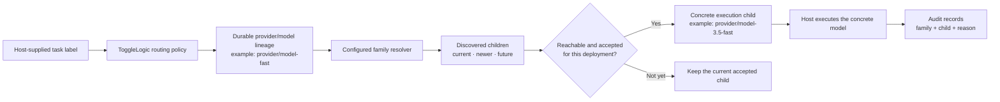

# Model-Family Routing: Pin the Lineage, Resolve the Child

Model releases change faster than most deployment configuration. A durable
routing policy should therefore name a provider-constrained model lineage, not
one numbered release that will soon become stale.

*This architecture may be protected by our patent pending.*

## The portable contract

- The durable policy names a provider and model lineage.
- The resolver may advance only within that lineage.
- Discovery does not equal acceptance. A candidate must be reachable and pass
  the deployment's qualification policy.
- Adjacent product lines do not satisfy the family merely because their names
  share a provider or prefix.
- The host still needs a concrete model identifier at execution time.
- The audit record should preserve both the durable family selected and the
  concrete child actually executed.
- A missing current-run family-plus-child receipt must fail verification; an
  older receipt cannot be borrowed to prove a new run.

## Why developers should care

Hardcoding a numbered model throughout application logic creates upgrade work
and ambiguous ownership. Family routing concentrates change at the resolver:
the policy remains stable while the accepted execution child can advance.

This does not make newest automatically mean best. The deployment owns its
acceptance criteria and rollback policy. ToggleLogic applies the configured
route; the host proves what ran; the deployment verifies whether that result is
acceptable for its users.
