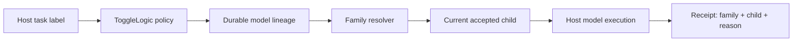

# ToggleLogic Free 1.5.0

ToggleLogic Free 1.5.0 makes its governed-escalation boundary portable across
agent deployments. The routing core no longer assumes that an agent is named
SAM or that every owner uses the same approval vocabulary.

## What changed

- Approval notices use deployment-neutral language.
- Deployments can supply exact affirmative and negative phrases, the external
  data notice, and optional friendly provider and model names.
- The final confirmation displays the deployment's configured decision words.
- The integration responsibility contract explains which guarantees belong to
  the host runtime, ToggleLogic, the deployed agent, and a business integration.

## What did not change

The approval state machine remains deterministic, fail-closed, bound to one
turn, and valid for one execution. ToggleLogic still chooses and records model
routes; it does not authenticate an owner, manufacture an email or CRM action,
or claim that an external action succeeded without a deployment-owned receipt.

## Developer architecture note

Do not hardcode a numbered model as the permanent routing target. Pin policy to
a provider-constrained model lineage, resolve the current accepted child at the
execution boundary, and record both values in the current-run receipt.

*This architecture may be protected by our patent pending.*

The full portable contract, including discovery, acceptance, adjacent-line
exclusion, and fail-closed verification, is documented in the
[model-family routing architecture](https://github.com/ToggleLogic/togglelogic-free/blob/main/docs/MODEL-FAMILY-ROUTING-ARCHITECTURE.md).

## Validation

- 82 automated tests passed.
- The release-quality and package-boundary checks passed.
- An independent code review completed.
- SAM-HQ completed the owner acceptance canary on OpenClaw `2026.9.4` with a
  current-run Google Gemini Flash family receipt, no fallback, and an exact
  deterministic PASS verdict.

## Upgrade note

The safe defaults remain exact `Yes` and `No`. Deployments that accept phrases
such as `Approved`, `Go ahead`, or localized equivalents must list those phrases
in `governedEscalation.approvalLanguage`. These settings affect presentation and
deterministic normalization only; they do not grant owner authority.
